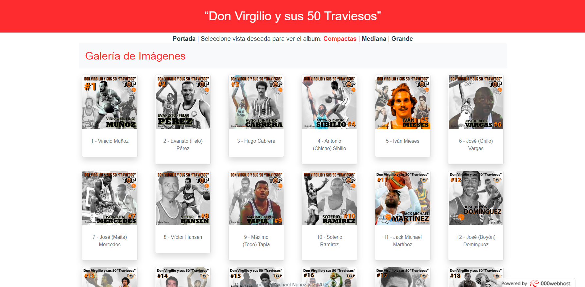

# 50bestvts
This projects store the list of the 50 best basketball players in the history (last 46 years) of the Virgilio Travieso Soto en Santo Domingo, Dominican Republic. This project was worked based in the cancha entera's work and we published the list in the internet.

The project was worked in the following technology: **Vuejs**.



Ver [Demo](https://50bestvts.000webhostapp.com/)

The web page has three differente views.
* **Compactas:** allows to the user to see 6 images per row.
* **Medianas:** allows to the user to see 4 images per row.
* **Grandes:** allows to the user to see the 3 images per row .

## Project setup
```
npm install
```

### Compiles and hot-reloads for development
```
npm run serve
```

### Compiles and minifies for production
```
npm run build
```

### Run your tests
```
npm run test
```

### Lints and fixes files
```
npm run lint
```

### Customize configuration
See [Configuration Reference](https://cli.vuejs.org/config/).
